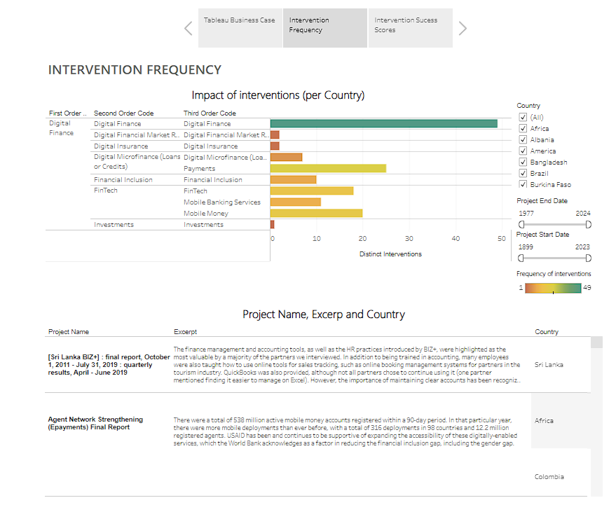

# Business Case Analysis: Digital Finance Interventions

## Overview

This repository contains an analysis of various digital finance interventions across different countries, focusing on financial inclusion, mobile banking, digital insurance, and fintech solutions. The data is visualized using **Tableau** and success metrics are calculated based on the outcomes of different projects.

### Key Areas of Focus:
- **Digital Finance**: Includes mobile banking, mobile money, and microfinance (loans/credits).
- **Financial Inclusion**: Efforts to close the financial gap, particularly in developing regions.
- **FinTech**: Use of technology to improve financial services, especially in underbanked areas.
- **Business Growth**: Analysis of interventions' success in enhancing productivity and access to financial services.

## Key Metrics

The success of each intervention was scored based on several factors, including:
- **Business Growth**: Improvement in productivity and business access to digital finance tools.
- **Financial Inclusion**: Increase in the number of active mobile money accounts and digital payments.
- **Outcome Success Scores**: Evaluations are done using a scale, comparing interventions' effectiveness per country.

## Visualizations

The data analysis and visualization are done using **Tableau**, presenting the following:
- Intervention frequency and success scores.
- Country-wise analysis of digital finance solutions.
- The impact of each intervention on business growth and financial inclusion.

## Tableau Dashboard

You can explore the interactive Tableau dashboard on Tableau Public:

🔗 **[View Dashboard on Tableau Public](https://public.tableau.com/views/Tableau_Business_Case_2024/Story?:language=en-US&:sid=&:redirect=auth&:display_count=n&:origin=viz_share_link)**

# License

## All Rights Reserved

All content in this repository, including but not limited to text, data, visualizations, and other files, is the exclusive property of the author and is protected by copyright laws and international treaties. 

### Restrictions

You **MAY NOT**:
- Use, copy, modify, merge, publish, distribute, sublicense, and/or sell copies of this information.
- Share, disclose, or make any portion of this material available to any third party, either in its original or modified form.
- Use any part of the content in any project, publication, or commercial purpose.

### Permissions

You **MAY**:
- View and read the content for personal, non-commercial purposes only.
- Contact the author to request permission for specific uses, which may or may not be granted at the author's sole discretion.

### Liability

The information in this repository is provided "as is", without warranty of any kind, express or implied. In no event shall the author be held liable for any damages or other liability, whether in an action of contract, tort, or otherwise, arising from the use or inability to use this content.

### Author

- Miquel Serra González

